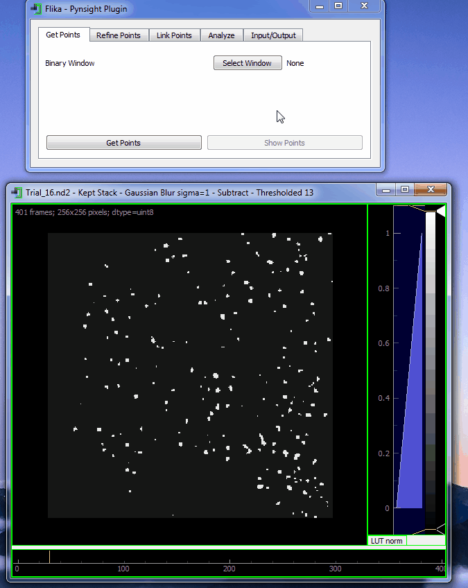

## Pynsight ##

**Pynsight** is an open source clone of Insight2 written in Python. It can be used to analyze 2D STORM microscopy movies.




### Installation Instructions ###

Pynsight is a Flika plugin. To install Flika, go [here](https://github.com/flika-org/flika) and follow the instructions. Once Flika is installed, from inside Flika go to Plugins, Plugin Manager, select Pynsight from the list, and press Download. Pynsight will then be available under Plugins. 


### Sample Script ###
To test Pynsight, run the following sample script:

```python
from plugins.pynsight.pynsight import *
from plugins.pynsight.particle_simulator import particle_simulator
simulated_particles = particle_simulator(.1, .01, 50, .1, 500, 128, .1, .16)
data_window = Window(simulated_particles.particle_window.image)
data_window.setName('Data Window (F/F0)')
blur_window = gaussian_blur(2, norm_edges=True, keepSourceWindow=True)
blur_window.setName('Blurred Window')
binary_window = threshold(18, keepSourceWindow=True)
binary_window.setName('Binary Window')
pynsight.gui()

```

You should be left with 3 movies: the original window, the blurred window, and the binary window. Go to Plugins->Pynsight->Pynsight. Work your way through the tabs from left to right. 